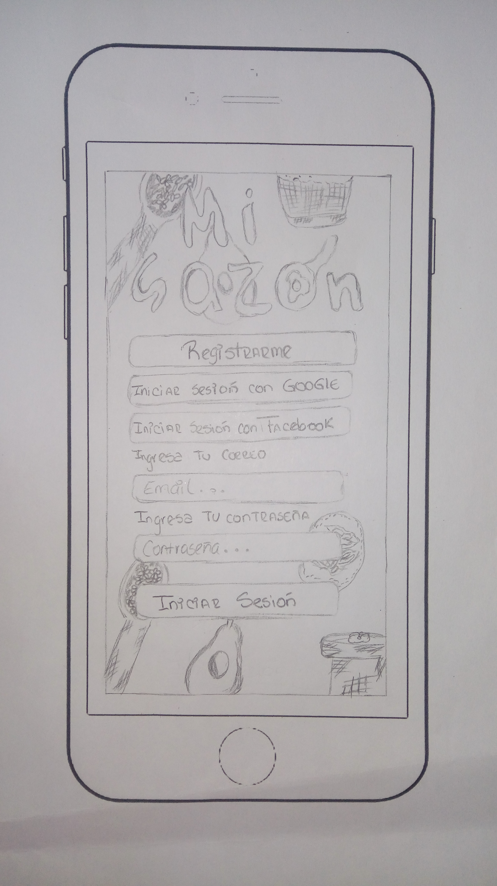
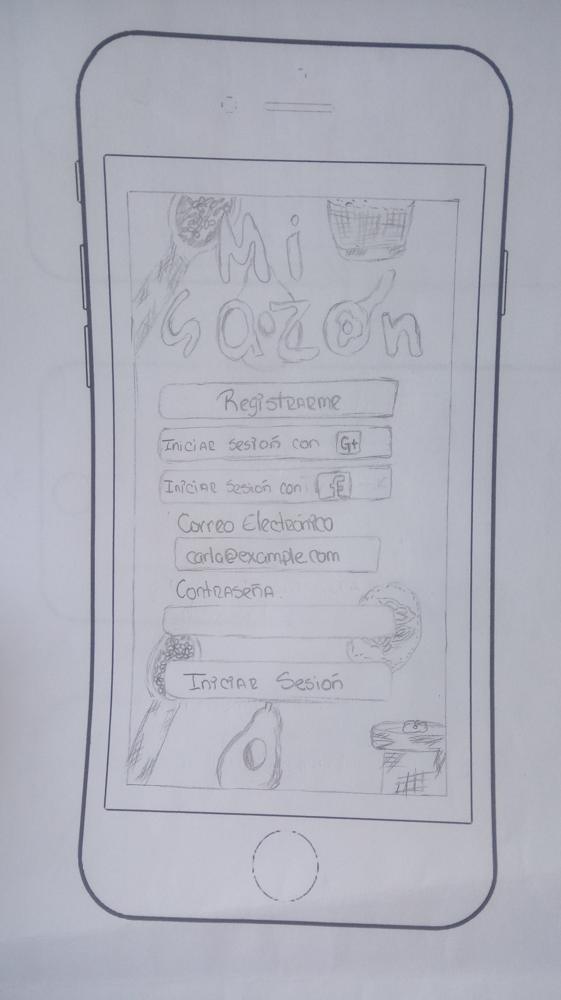
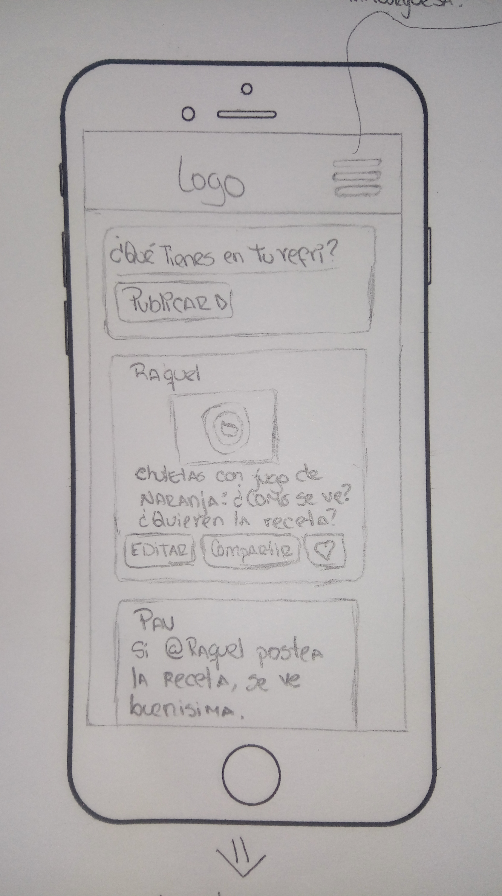
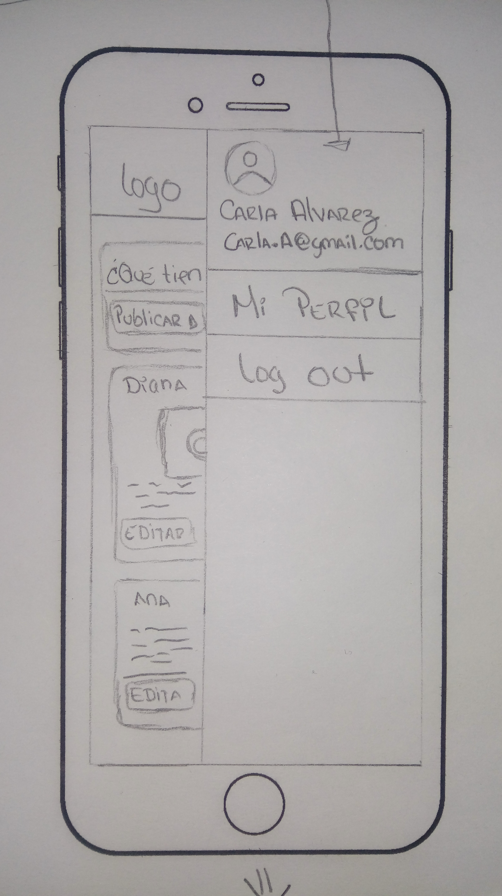

# Creando una Red Social

## Preámbulo

Instagram, Snapchat, Twitter, Facebook, Twitch, Linkedin, etc. Las redes
sociales han invadido nuestras vidas. Las amamos u odiamos, y muchos no podemos
vivir sin ellas.

Hay redes sociales de todo tipo y para todo tipo de intereses. Por ejemplo,
en una ronda de financiamiento con inversionistas, se presentó una red social
para químicos en la que los usuarios podían publicar artículos sobre sus
investigaciones, comentar en los artículos de sus colegas, y filtrar artículos
de acuerdo a determinadas etiquetas o su popularidad, lo más reciente, o lo
más comentado.

## Introducción

Una emprendedora nos ha encargado crear una red social. No nos da mucho detalle
sobre qué tipo de red social quiere, sólo nos dice que creemos la mejor que
podamos, y que luego la convenzamos de lanzarla al mercado. Nos da ciertos temas
en los que le gustaría invertir:

* Alimentación
* Feminismo
* Educación
* Salud
* Energías Renovables

## Objetivos

El objetivo principal de aprendizaje de este proyecto es construir un sitio web
[_responsive_](https://github.com/Laboratoria/curricula-js/tree/master/topics/css/02-responsive)
con más de una vista (página), y en el que podamos leer y escribir datos.

Algunos objetivos específicos:

* Entender las necesidades de los usuarios para los que crearás el producto y
  que ayudarás a resolver.
* Poner en juego tu creatividad para generar ideas que lleven a una solución
  original y valiosa del problema.
* Cuentas con el apoyo de tus compañeras, debes trabajar en equipo buscando
  _feedback_ constante.

## Consideraciones generales

Este proyecto se debe "resolver" en trios.

La lógica del proyecto debe estar implementada completamente en JavaScript
(ES6), HTML y CSS. En este proyecto **SÍ está permitido** usar librerías o
frameworks, pero **no es obligatorio** :smiley:.

Para comenzar tendrás que hacer un _fork_ y _clonar_ este
repositorio.

## Parte obligatoria

### General

En este proyecto, hay un _boilerplate_ basico , sin configuración y una estructura recomendada de carpetas (Puedes modificar, agregar o quitar lo que creas necesario), puedes guiarte de los proyectos anteriores. Por lo tanto, los _tests_ y el _setup_ necesario para ejecutarlos serán hechos por ti misma. Recuerda, _todos los archivos estan vacios_  :smiley:.

En tu  `README.md`, cuéntanos cómo pensaste y te acercaste a los usuarios,
y cuál fue tu proceso para definir el producto final en términos de experiencia
y de interfaz. Si tienes fotos de entrevistas, cuestionarios y/o
sketches(bocetos) compártelos.

### Responsive

Debe verse bien en dispositivos de pantallas grandes
(computadoras/es, laptops, etc.) y pequeñas (tablets, celulares, etc.). Te
sugerimos Seguir la técnica de `mobile first` (más detalles sobre esta técnica
al final).

### Objetivos
Diseñar y construir una red social en la cual contega un log-in, con el que se
pueda accesar a la plataforma, que sea fácil de manipular, amigable al usuario,
además de que se pueda utilizar en distintos dispositivos: moviles, tablets y
desktops.

### Enfoque:
Intercambio de recetas de comida, entre comunidad interesada en recetas fáciles,
económicas, populares, y nutritivas.

### Proto-Usuario:
Raquel es una mujer de 25 años que vive con su familia (esposo e hijo) en la
ciudad de México. Ella trabaja en una empresa de servicios en un horario de
9 a 6 pm y percibe un ingreso promedio (8 000). Una de sus necesidades es
procurar para su familia una alimentación saludable y equilibrada dentro de sus
posibilidades económicas. Raquel gusta de buscar recetas de comida en internet
que parecen fáciles y tienen pocos ingredientes. Sin embargo, los resultados de
su búsqueda siempre concluyen  en recetarios online de comida que no permiten
una retroalimentación con la comunidad, de tal forma que se puedan intercambiar
versiones. Por tanto las redes sociales enfocadas al intercambio de recetas
son muy escasas en el mercado, y se espera con la implementación de esta, crear
un espacio, en donde la comunidad en general pueda ser capaz de acceder a
recetas locales, que no requieran tanto tiempo de preparación o una gran
inversión en los ingredientes.

### Alcances esperados por la red social:
Con la creación de la red social, esperamos no ser un repositorio de recetas de
cocina, es decir, esperamos crear un espacio en donde los usuarios puedan encontrar,
compartir,  crear y debatir sus propias recetas de cocina, adecuándose a su lugar
de origen, gustos, necesidades y posibilidades teniendo como aporte, la variedad
de público, la variedad de gustos, y la variedad de ingredientes.

Esperamos que la red social, sea un espacio en donde, de forma rápida y remota se
puedan obtener resultados inmediatos que faciliten la problemática del ¿Qué puedo
comer, que sea rápido, que sea rico, y que no sea muy caro?

### Preámbulo:
La alimentación es un tema fundamental en cualquier sociedad del mundo, las formas
y los ingredientes, siempre varían de persona a persona por lo que  en la actualidad,
tener variedad y sabor es lo más buscado entre la población.  Los tutoriales de cocina,
así como los recetarios y blogs en línea son muy populares, de hecho en la actualidad
existen aplicaciones móviles que te permiten aprender recetas previamente sugeridas,
algunas aplicaciones son:

#Nestlè Cocina:

Un manual de cocina en formato app para iOS y Android. Para acceder a cada plato
es posible utilizar un buscador y después afinar los resultados con distintos
filtros o bien emplear los submenús disponibles, como Recetas vegetarianas,
Recetas sin gluten, Tipo de alimento, Recetas familiares u Ocasiones especiales,
entre otros.
Una vez que seleccionamos la receta, en su ficha encontramos textos con información
nutricional por ración (hidratos, grasas, proteínas…), los ingredientes,las indicaciones
para la preparación y consejos adicionales. Pero, además, la mayoría de ellas lleva
asociado el enlace a un vídeo del canal de YouTube de Nestlé Cocina para seguir
el paso a paso de la elaboración.
Para los que no tienen claro qué cocinar, esta aplicación ofrece dos funciones:
La primera de ellas es “Mi nevera”, un submenú en el que el usuario introduce
ingredientes y a cambio obtiene sugerencias de los platos que puede elaborar con
ellos. Y, por otro lado, con la opción “Cena Planner”, la app recomienda una cena
complementaria a la comida que se ha hecho ese mismo día.
Uno de sus puntos a favor, sobre todo para los más recelosos de su intimidad, es
que puede utilizarse sin registro, aunque también se ofrece la creación de un
“usuario único” que da acceso a todas las webs de Nestlé y con el que se puede
participar en sorteos y promociones, para lo cual hay que proporcionar NIF,
fecha de nacimiento y un correo electrónico. De igual modo, este registro es
necesario para marcar como favoritas las recetas de la app con el fin de guardarlas
 y que el usuario pueda crear sus propias listas.

#PetitChef:

Engloba más de 20.000 recetas que pueden filtrarse por tres tipos distintos:
Entrante, Plato principal y Postre. Pero para aquellos que no quieran darle muchas
vueltas a la cabeza, nada más entrar en la app se ofrece el menú del día, configurado
por una propuesta de cada una de esas categorías. Si esa sugerencia no es suficiente,
es posible ir hacia atrás y consultar los menús de días anteriores.
Una vez seleccionada una receta concreta, al acceder a su ficha encontramos
información con los ingredientes y el paso a paso de su preparación. Todo ello a
través de explicaciones muy sencillas que, en ocasiones, se acompañan de fotos
detalladas y vídeos, así como de opiniones aportadas por los usuarios, lo cual
otorga una capa social a PetitChef.
Sin embargo, uno de sus puntos negativos es que muestra demasiada publicidad mientras
se navega por sus distintas funciones.
Al igual que la anterior, PetitChef puede utilizarse sin necesidad de registro,
aunque si el usuario quiere guardar recetas para crear su lista de favoritos debe
crearse una cuenta y proporcionar un correo electrónico. Está disponible para
dispositivos iOS y Android.

#Cookpad:

Plataforma en la que los propios usuarios los que suben las fotos de los platos
que han elaborado, sus ingredientes y los pasos para su elaboración. Funciona como
cualquier red social, de tal modo que en primer lugar es necesario formalizar un
registro (a través de Facebook, Google+ o un correo electrónico) y a partir de ahí
comienza a configurarse el muro donde queda reflejada la actividad del usuario y
la de aquellos a los que sigue.
Según sus responsables, se han publicado ya cerca de 200.000 recetas y en cada
una de ellas se plantean dudas o se aportan consejos a aquellos que las han compartido,
pero además es posible establecer conversaciones privadas dentro de la app gracias a
un chat que funciona como cualquier aplicación de mensajería instantánea.
Cuenta con versiones gratuitas para iOS y Android, pero también con una edición
Premium para ambos sistemas operativos por 2,99 euros mensuales que entre otras
ventajas facilita la búsqueda de un plato concreto a través de la reorganización
de los resultados y permite descargar recetas para consultarlas posteriormente sin
conexión a Internet.

### Benchmarking de las principales redes sociales:

Presentamos las conclusiones del benchmark realizado

Entrevistas con usuarios
Me tomé el atrevimiento de lanzar una pequeña encuesta sobre la búsqueda y uso de
las recetas por internet, para tener un poco mas de idea sobre el terreno donde
estamos paradas y que se puede ofrecer a personas normales, que viven inmersos
en la rutina del día a día.

De los resultados obtenidos hasta el momento podríamos decir que:
    • Los usuarios buscan recetas por internet, pero no son usuarios de una red
    social específica
    • De acuerdo con la respuestas recibidas no son usuarios de las redes sociales
     que se han considerado en el benchmark
    • Consumen las recetas de redes sociales más genéricas como youtube, pinterest
    • Coinciden en que no encuentran recetas saludables
    • coinciden en que no encuentran recetas con ingredientes fáciles de conseguir
     o que tienen disponibles

#Resultados de encuesta:

Una vez que se definieron las nececidades de nuestro producto comenzamos con un
User Flow, para ayudarnos  a comprender el comportamiento  y asi poder materializar
frente al cliente las interacciones de los usuarios con sus productos, llegando asi
al funcionamiento del producto solicitado, como se muestra a continuación:

# Como siguiente paso se realizo un sketch a lapiz y papel donde se plasma a grandes rasgos la interfaz con los elementos que ayudaran con la interacción de la misma, el cuál se mostro a nuestro cliente para su aprovación.

# Una vez hechos los cambios pertinentes se paso a diseñar la interfaz con ayuda de una herramienta de diseño visual (Figma), como se puede apreciar a continuación:

# Luego de testear nuestro login, los usuarios nos comentaron que nuestro logo no era agradable a la vista, por este motivo se procedió a modificar el logo a lapiz y papel, viendose de esta manera:

# Luego, se paso a diseñar la interfaz con ayuda de una herramienta de diseño visual (Figma), como se puede apreciar a continuación:

 

# El cliente pide que no solo pueda registrarse con usuario y contraseña, sino que también se pueda autenticar con Facebook o Google, por ende se elaboró como se vería el login con dichos requerimientos; primero a lapiz y papel:

# Luego, se paso a diseñar la interfaz con ayuda de una herramienta de diseño visual
 (Figma), como se puede apreciar a continuación:

 

 

El sketch a lapiz y papel, se realizó pensando en mobile-first, se implemento un menú hamburguesa del lado superior derecho con su respectivo logo, al darle “click” en el menú se desplegará una lista donde se podrá apreciar el perfil de usuario con una foto del mismo y un opción que nos permita cerrar la sesión (log out) al volver a darle “click” al menú de hamburguesa, este se ocultará dandole paso a la primera pantalla de nuestro muro se podra observar una caja que te pregunta de manera muy explicita ¿Qué tienes en tu refri? , donde se podrá públicar lo que desees saber acerca de recetas de cocina. Luego se verán publicaciones de aquellas personas a las que agregaste a tu red social la cual va a contener posting de recetas, o sugerencias de las mismas. Se podrá editar, compartir y hasta darle like (con un corazón) al post que sea de su agrado. Luego de observar como se vería nuestra interfaz en lapiz y papel , y plasmando todos los requerimientos que se necesitaban se procedió a realizar a color  las interfaces con ayuda de Figma. Se buscó que nuestra interfaz  fuera los mas amigable posible , fácil de usar pero sobre todo fácil de entender para el usuario.

# A continuación se mostrarán los sketches a lapiz y papel:

 

 

# Finalinzando con la utilización de la herramienta (Figma):

### Tests

Los tests unitarios deben cubrir un mínimo del 70% de _statements_, _functions_,
_lines_, y _branches_.

### UI y comportamiento (User Interface / Interfaz de Usuario)

La interfaz debe permitir lo siguiente:

#### Creación de cuenta de usuario e inicio de sesión

* Login con Firebase:
  - Solamente para el login es obligatorio usar Firebase, no para las
    publicaciones en el muro ni las demás funcionalidades, pare eso puedes
    usar [`localStorage`](https://developer.mozilla.org/es/docs/Web/API/API_de_almacenamiento_web/Usando_la_API_de_almacenamiento_web).
  - Autenticación con Facebook - Google.
* Validaciones:.
  - No pueden haber usuarios repetidos.
  - La cuenta de usuario debe ser un correo electrónico válido.
  - Lo que se escriba en el campo(_input_) de contraseña debe ser secreto.
* Comportamiento:
  - Al enviarse un formulario de registro o inicio de sesión, debe validarse.
  - En caso haya errores, el sistema debe mostrar mensajes de error para
    ayudar al usuario a corregirlos.
  - La aplicación solo permitirá el acceso a usuarios con cuentas válidas.
  - Al recargar la aplicación, se debe verificar si el usuario está
    logueado antes de mostrarle el contenido privado.
* Perspectiva de interfaz:
  

#### Muro/timeline de la red social

* Validaciones (debe tener al menos 8):
  - Al apretar el botón de publicar, debe validar que exista contenido en el input.
* Comportamiento:
  - Debe poder publicar un post, imagen, post e imagen, etc.
  - Poder poder like/Estrella (o similar) a una publicación.
  - Debe poder llevar ó ver cuántos me like/Estrella (o similar) tiene una publicación.
  - Debe poder eliminar un post/publicación específico.
  - Debe pedir una confirmación antes de eliminar un post/publicación.
  - Al darle click en el botón *editar*, debe poder cambiar el texto, imagen, post e imagen, o lo que contenga la publicación.
    (se sugiere que el texto cambie a un input, permita editar el texto y que el
    tenga un botón `editar` se convierta en `guardar`).
  - Al editar solo debe poder editar sus propios post y **NO** los post de los demás usuarios.
  - Al darle `guardar` debe regresar de vuelta a la forma que tenia antes la publicación
    a un texto normal pero con la información editada.
  - Al recargar la página debo de poder ver los textos editados y publicaciones
    anteriores (persistencia).
  - Debe poder agregar nuevos amigos
  - Debe poder aceptar solicitudes de amigos
  - Debe poder eliminar amigos
  - Debe poder filtrar los posts sólo para mis amigos y para todo público.
  - Debe poder publicar solo para mis amigos
  - Debe poder publicar públicamente, visible para todos los usuarios de la red social.
  - Debe poder enviar mensajes privados a mis amigos.
* Perspectiva de interfaz:
  

#### Otras consideraciones

  - La aplicación **NO** debe poder dejar hacer publicaciones vacías de ningún tipo.
  - El usuario debe poder agregar, editar y eliminar contenido de la red
    social.
  - El usuario debe poder definir la privacidad de lo que pública.
  - Al editar contenido, el contenido editado se verá automáticamente,
    inmediatamente después de guardar.
  - Al recargar la página se deben poder ver los contenidos editados.

Para armar la interfaz visual, utiliza como base alguna de estas guías de
componentes:

* [Guía Desktop 1](https://www.figma.com/file/F3aUqpHWOfZsEQifTPIleXo6/material-kit-free)
* [Guía Desktop 2](https://www.figma.com/file/S39H0B1LOnaVICIUiApFTfoP/_Style-Guide---Desktop---Style-Guide)
* [Guía Mobile 1](https://www.figma.com/file/00VTwmTNvLVaBLkxrMFbT8/Google-Material-Design)
* [Guía Mobile 2](https://www.figma.com/file/O2Xraz3mraQHvevNsicMl91V/ejemplos-2)

Personaliza estas guías con los colores y/o tipografías que creas convenientes.
Recuerda que al hacer estas adaptaciones deberás seguir los fundamentos de
_visual design_ como contraste, alineación, jerarquía, entre otros.

## Implementación

### Front end

El corazón de este proyecto incluye:

* Separar la manipulación del DOM de la lógica (Separación de responsabilidades).
* Que el sitio sea responsive, ya dicho.
* Alterar y persistir datos.  Los datos que agregues o modifiques deberán
  persistir a lo largo de la aplicación, te recomendamos que uses
  [`localStorage`](https://developer.mozilla.org/es/docs/Web/API/API_de_almacenamiento_web/Usando_la_API_de_almacenamiento_web)
  como primera opción para resolver este desafío, aun así, tú
  puedes optar por la que se acomode más a tu equipo.

Además, podrías agregar algunas tareas nuevas de acuerdo a tus decisiones:

* Recuerda que puedes usar una librería y/o framework si así lo desea el equipo,
  al navegar en internet te darás cuenta de que algunas de estas construyen un
  **boilerplate** por ti (Si no quieres usar la estructura propuesta), tenlo presente al iniciar tu proyecto.
* Recuerda que no hay un setup de **tests** definido, dependerá de
  la estructura de tu proyecto también, pero algo que no debes de olvidar es
  pensar en éstas pruebas, incluso te podrían ayudar a definir la estructura y nomenclatura de tu lógica.

### UX

Desde el punto de vista de UX, deberás:  

* Hacer un _benchamark_ de las principales redes sociales.
* Hacer al menos 2 o 3 entrevistas con usuarios.
* Hacer un  prototipo de alta fidelidad.
* Testear el prototipo con usuarios.
* Asegurarte de que la implementación en código siga los lineamientos del
  diseño.
* Hacer sesiones de testing con el producto en HTML.

### Ágil

Vamos a dar un paso importante para seguir aprendiendo de Ágil. Te será de mucha
ayuda para ir avanzando tu proyecto de forma incremental y no en cascada.

Esta vez te pedimos que los ítems de tu Backlog de Producto estén escritos
como [Historias de Usuario](http://jmbeas.es/guias/historias-de-usuario/).
Esta es una técnica muy simple que te ayudará a:

* Organizar el trabajo en función del valor que le aporta al usuario.
* Poder publicar partes completas y utilizables del producto al final del
  sprint.
* Que el equipo trabaje de manera multidisciplinaria de manera natural.

### Habilidades Blandas

Trabajar en equipo es un gran desafío porque coordinarse no es una tarea fácil,
y es más difícil entre tres que entre dos. Trata que tu equipo te entienda,
facilitando siempre el diálogo en dentro del squad **Apoyate de "Minestrone e Issues en Github"**.

Planifica enumerando las tareas y distribuyéndolas, considerando los
recursos, las habilidades, y el tiempo del que dispones. Planifica de manera
que te permita avanzar en los distintos aspectos del proyecto de forma paralela,
teniendo un tablero donde puedas ver en qué está trabajando cada compañera.

Entrega tu trabajo a tu equipo a tiempo y colabora con el objetivo
final del proyecto, lo que puede implicar ayudar a los demás miembros del equipo
con sus pendientes, con el fin de entregar una red social de calidad.

**La división del trabajo debe permitir que todo el equipo
practique el aprendizaje de todas las habilidades esperadas. No se dividan el
trabajo como en una fábrica**

Para conocer a los usuario para eso debes salir e investigar. Tienes que
ejercitar tus habilidades de comunicación y toma de decisiones.
Existen infinitas opciones, depende de ti el camino que escoges.
Para que tu red social responda a las necesidades de sus usuarios, probablemente
deberás adquirir nuevos conocimientos para implementar sus preferencias.

Esta vez, haz _code review_(feedback de tu código) con **otro squad**, para
que puedas mejorar el producto. Mientras más feedback reciban, mejor.

Esperamos que valores y escuches los comentarios y críticas de los demás,
rescatando aquellos aspectos que sirven para tu crecimiento. Entrega siempre
tu opinión de manera constructiva, fundamentada y coherente, con el propósito
de ayudar a tus compañeras. Estos comentarios los debes hacer de manera honesta,
empática e inmediata.

Finalmente, deberás presentar el proyecto que creaste, al usuario que escogiste
y las necesidades que lograste resolver en este proceso. Como siempre, sabemos
que presentar puede ser una tarea difícil, esperamos que tengas capacidad de
síntesis y articules tus ideas con claridad para que logres mostrar tu trabajo
y que los demás lo comprendan.

## Hacker edition

* Crear posts con imágenes
* Reemplazar `localStorage`, ¿le has compartido tu red social a tus amigxs? Si
  lo has hecho, te darás cuenta de que ellxs no pueden ver tus posts ni tú el de
  ellxs. Esto es debido a que `localStorage` almacena los datos localmente
  (en tu navegador) por lo que esos datos no se comparten. Para resolver esto
  podrías implementar una base de datos pero el tiempo podría jugar en contra,
  para ello existen algunos servicios como [Firebase](https://firebase.google.com/products/database/)
  que te proveen soluciones rápidas a este problema y solo usando su SDK :scream:.

## Entrega

El proyecto será _entregado_ subiendo tu código a GitHub (`commit`/`push`) y la
interfaz será desplegada usando GitHub pages u otro servicio de hosting que
puedas haber encontrado en el camino.

### Entregables

#### 1) Definición del producto

En el `README.md` cómo conociste el mercado de las redes sociales, cómo
descubriste las necesidades de los usuarios, cómo llegaste  la definición final
de tu producto. Es importante que detalles:

* Cuáles son los elementos básicos que tiene una red social
* Quiénes son los principales usuarios de producto
* Qué problema resuelve el producto para estos usuarios
* Cuáles son los objetivos de estos usuarios en relación con el producto
* Cuáles son las principales funcionalidades del producto y cuál es su prioridad
* Cómo verificaste que el producto les está resolviendo sus problemas
* Cómo te asegurarás que estos usuarios usen este producto

Para poder llegar a estas definiciones te recomendamos ver: benchmarks,
entrevistas con usuarios y tests de usabilidad.

#### 2) Diseño de la Interfaz de Usuario (prototipo de alta fidelidad)

Debes definir cuál será el flujo que seguirá el usuario dentro de tu producto y
con eso deberás diseñar la Interfaz de Usuario (UI por sus siglas en inglés) de
esta red social que siga este flujo. Para esto debes utilizar la herramienta de
diseño visual de tu preferencia. Nosotros te recomendamos Figma dado que es una
herramienta que funciona en el navegador y puedes crear una cuenta gratis. Sin
embargo, eres libre de utilizar otros editores gráficos como Illustrator,
Photoshop, PowerPoint, Keynote, etc.

Este diseño debe representar la solución que se implementará finalmente en
código.

Tu diseño debe seguir los fundamentos de visual design, como: contraste,
alineación, jerarquía, entre otros. Tip: revisa el contenido de UX de la unidad
de visual design.

#### 3) Implementación de la Interfaz de Usuario

La idea para este producto es que el producto a desarrollar siga los
lineamientos propuestos en el diseño de la interfaz de usuario. Asegúrate a lo
largo de la implementación que los elementos propuestos están siendo
implementados correctamente. (Hint: testing)

## Evaluación

### Tech

| Habilidad | Nivel esperado |
|-----------|----------------|
| **JavaScript** | |
| Estilo | 3
| Nomenclatura/semántica | 3
| Funciones/modularidad | 2
| Estructuras de datos | 2
| Tests | 2
| **HTML** | |
| Validación | 3
| Estilo | 3
| Semántica | 3
| SEO | n/a
| **CSS** | |
| DRY | 3
| Responsive | 3
| **SCM** | |
| Git | 3
| GitHub | 3
| **CS** | |
| Lógica | 2
| Arquitectura | 2
| Patrones/paradigmas | n/a

### UX

| Habilidad | Nivel esperado |
|-----------|----------------|
| User Centricity | 3
| Entrevistas | 2 |
| Testing | 2
| User Flow | 2
| Jerarquía | 3
| Alineación | 3
| Contraste | 3
| Color | 3
| Tipografía | 3

### Habilidades Blandas

Para este proyecto esperamos que ya hayas alcanzado el nivel 3 en todas tus
habilidades blandas. Te aconsejamos revisar la rúbrica:

| Habilidad | Nivel esperado |
|-----------|----------------|
| Planificación y organización | 3
| Autoaprendizaje | 3
| Solución de Problemas | 3
| Dar y recibir feedback | 3
| Adaptabilidad | 3
| Trabajo en equipo (trabajo colaborativo y responsabilidad) | 3
| Comunicación eficaz | 3
| Presentaciones | 3

***

## Pistas / Tips / Lecturas complementarias

### Mobile first

El concepto de [_mobile first_](https://www.mediaclick.es/blog/diseno-web-responsive-design-y-la-importancia-del-mobile-first/)
hace referencia a un proceso de diseño y desarrollo donde partimos de cómo se ve
y cómo funciona la aplicación en un dispositivo móvil primero, y más adelante se
ve como adaptar la aplicación a pantallas progresivamente grandes y
características específicas del entorno desktop. Esto es en contraposición al
modelo tradicional, donde primero se diseñaban los websites (o webapps) para
desktop y después se trataba de _arrugar_ el diseño para que entre en pantallas
más chicas. La clave acá es asegurarse de que desde el principio diseñan usando
la vista _responsive_ de las herramientas de desarrollador (developer tools) del
navegador. De esa forma, partimos de cómo se ve y comporta la aplicación en una
pantalla y entorno móvil.

### Múltiples vistas

En proyectos anteriores nuestras aplicaciones habían estado compuestas de una
sola _vista_ principal (una sóla _página_). En este proyecto se introduce la
necesidad de tener que dividir nuestra interfaz en varias _vistas_ o _páginas_
y ofrecer una manera de navegar entre estas vistas. Este problema se puede
afrontar de muchas maneras: con archivos HTML independientes (cada uno con su
URL) y links tradicionales, manteniendo estado en memoria y rederizando
condicionalmente (sin refrescar la página), [manipulando el historial del
navegador](https://developer.mozilla.org/es/docs/DOM/Manipulando_el_historial_del_navegador)
con [`window.history`](https://developer.mozilla.org/es/docs/Web/API/Window/history),
usando una librería (por ejemplo [`react-router`](https://github.com/ReactTraining/react-router)
o [`vue-router`](https://router.vuejs.org/)). En este proyecto te invitamos a
explorar opciones y decidir una opción de implementación.

### Escritura de datos

En los proyectos anteriores hemos consumido (leído) datos, pero todavía no
habíamos escrito datos (salvar cambios, crear datos, borrar, ...). En este
proyecto tendrás que crear (salvar) nuevos datos, así como leer, actualizar y
modificar datos existentes. Estos datos se podrán guardar localmente usando
[`localStorage`](https://developer.mozilla.org/es/docs/Web/API/Window/localStorage)
o de forma remota usando [Firebase](https://firebase.google.com/).

### Te dejamos un ejemplo de una historias de usuario del proyecto anterior (_Data-dasboard_)

En el proyecto "Data Dashboard", la primera historia "épica" podría haber sido:

Yo, como **Training Manager** quiero poder **ver el progreso de solución de
ejercicios de JS de las estudiantes de mi(s) cohort(s)** para **entender
cuánto están practicando y qué tan bien les está yendo**

Esta la podríamos haber dividido en algunas más pequeñas, por ejemplo:

1. Yo, como **Training Manager** quiero poder **seleccionar cada uno de los
   cohorts de mi ciudad** para **ver un listado de todas las estudiantes de ese
   cohort, y que incluya el % de progreso de solución de ejercicios de cada una
   de ellas**
2. Yo, como **Training Manager** quiero poder **seleccionar a una estudiante en
   particular** para **ver el % de progreso de solución de todos los ejercicios
   y el resultado decada uno de ellos**

Como ves, dividirla en 1 y 2, hace que sea mucho más fácil imaginar y entender
lo que el equipo tiene que conseguir para completarla.

### Te dejamos un ejemplo de una historias de usuario para este proyecto

En el proyecto de la *"red social"*, las primeras historias podrían ser:

* Yo, como una **feminista**, quiero poder registrarme en una nueva red social  para conectarme con otras personas con ideales como yo.
  - Yo, como usuaria registrada en esta red social quiero poder loguearme con mi correo para empezar a usar esta red.
  - Yo, como usuaria registrada en esta red social, quiero poder loguearme con mi cuenta facebook o google para empezar a usar esta red.

* Yo, como usuaria logueada en esta red social, quiero poder postear un mensaje en mi muro para que otras personas puedan ver lo que pienso.

* Yo, como usuaria logueada en esta red social, quiero poder editar o eliminar mis posts por si me arrepiento de lo que puse.

* Yo, como usuaria logueada  quiero poder darle like/estrellas a un posts para expresar mi apoyo a una publicación.

* Yo, como usuaria logueada quiero poder ver los posts publicos de otrxs usuarixs aunque no sean mis amigxs.

* Yo, como usuaria logueada quiero poder compartir posts de texto, imagen ó texto con imagen para comunicar mejor mis ideas.

Como ves en la primer historia, podemos dividir dicha historia en historias mas pequeñas, haciendo mas fácil imaginar y entender lo que el equipo tiene que conseguir para completarla e incluso podiendo dividir en tareas aún más pequeñas.

Otras:

* [Diseño web, responsive design y la importancia del mobile first - Media Click](https://www.mediaclick.es/blog/diseno-web-responsive-design-y-la-importancia-del-mobile-first/)
* [Mobile First: el enfoque actual del diseño web móvil - 1and1](https://www.1and1.es/digitalguide/paginas-web/diseno-web/mobile-first-la-nueva-tendencia-del-diseno-web/)
* [Mobile First - desarrolloweb.com](https://desarrolloweb.com/articulos/mobile-first-responsive.html)
* [Mobile First - ZURB](https://zurb.com/word/mobile-first)
* [Mobile First Is NOT Mobile Only - Nielsen Norman Group](https://www.nngroup.com/articles/mobile-first-not-mobile-only/)
* [Offline first manifesto](http://offlinefirst.org/)

***

## Checklist

### General

* [ ] Producto final sigue los lineamientos del diseño.

### `README.md`

* [ ] Definición del producto.
* [ ] Benchamark de las principales redes sociales.
* [ ] Resumen de entrevistas con usuarios.
* [ ] Link/screenshots prototipo de alta fidelidad.
* [ ] Conclusiones de pruebas del prototipo con usuarios.
* [ ] Conclusiones de pruebas con el producto en HTML.

### Pruebas / tests

* [ ] Tests unitarios cubren un mínimo del 70% de statements, functions, lines,
  y branches.
* [ ] Pasa tests (y linters) (`yarn test`).

### Creación de cuenta (sign up)

* [ ] Permite crear cuenta.
* [ ] Valida email.
* [ ] Valida password.
* [ ] Muestra mensajes de error.

### Inicio de sesión (sign in)

* [ ] Permite iniciar sesión.
* [ ] Valida email.
* [ ] Valida password.
* [ ] Muestra mensajes de error.

### Muro (wall/feed)

* [ ] Muestra _muro_.
* [ ] Permite publicar nuevos posts.
* [ ] Permite eliminar posts.
* [ ] Pide confirmación antes de borrar posts.
* [ ] Permite editar posts (in place).
* [ ] Permite filtrar posts por público/amigos.
* [ ] Permite marcar posts como _gustados_ (like).
